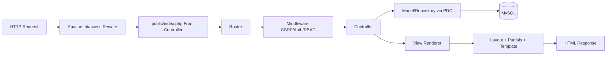
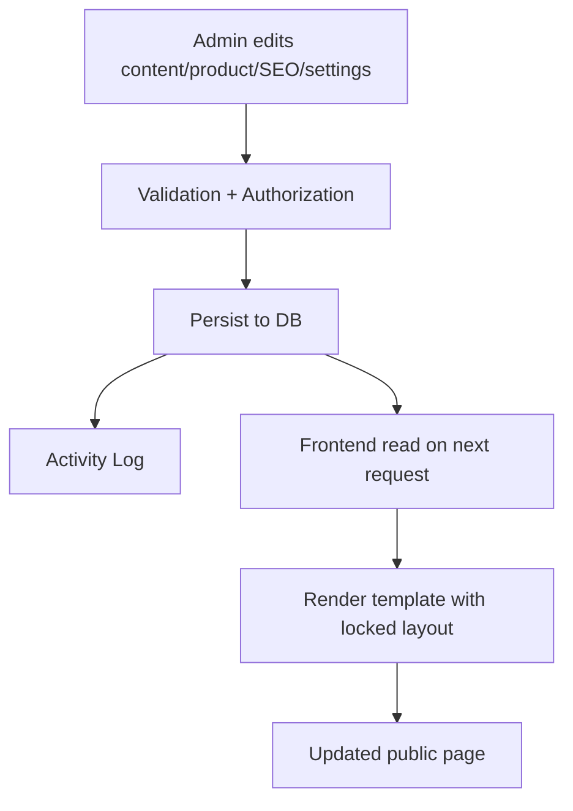

# Nuteck Paper Products - Frontend and Template Design Plan

## 1) Design Implementation Rules
- Approved `screens/*/code.html` and `screens/*/screen.png` are the visual source of truth.
- Layout composition is locked.
- Only editable:
  - text content
  - media assets
  - links/CTAs
  - SEO fields
  - script injections
  - controlled theme/site settings
- Global header/footer must follow `screens/homepage/code.html` only.
- Any differences in header/footer from other screen files are ignored.

## 2) Visual Tokens to Preserve
- Primary color: `#67C6D0`
- Primary hover: `#2F8FA1`
- Dark navy/background dark: `#0F1B2A`
- Background light: `#F8FAFC`
- Typeface: `Plus Jakarta Sans` (display + body from screen references)
- Icon system: Material Symbols Outlined
- Section spacing rhythm in screen HTML must be maintained.

## 3) Public Template Strategy

### 3.1 Base Layout
- `templates/layouts/public.php` (single shell):
  - `partials/head.php`
  - `partials/header.php` (homepage version globally)
  - page body (`$view`)
  - `partials/footer.php` (homepage version globally)
  - `partials/scripts.php`

### 3.2 Page Templates
- `templates/pages/home.php`
- `templates/pages/about.php`
- `templates/pages/contact.php`
- `templates/pages/product-catalog.php`
- `templates/pages/product-detail.php`
- `templates/pages/404.php`

### 3.3 Reusable Public Partials
- `partials/header.php`
- `partials/footer.php`
- `partials/nav.php`
- `partials/breadcrumbs.php`
- `partials/seo-meta.php`
- `partials/cta-section.php`
- `partials/product-card.php`
- `partials/form-enquiry.php`
- `partials/pagination.php` (catalog if needed)

## 4) Admin Layout and Module Views
- `templates/layouts/admin.php`:
  - topbar
  - sidebar
  - flash message area
  - module content outlet
- Modules:
  - `templates/admin/auth/*`
  - `templates/admin/dashboard/*`
  - `templates/admin/pages/*`
  - `templates/admin/products/*`
  - `templates/admin/media/*`
  - `templates/admin/seo/*`
  - `templates/admin/settings/*`
  - `templates/admin/users/*`

## 5) Screen-to-Template Mapping

| Screen Folder | Public Route | Template | Key Sections |
|---|---|---|---|
| `screens/homepage` | `/` | `home.php` | hero, trust blocks, category cards, enquiry CTA |
| `screens/about_us` | `/about-us` | `about.php` | hero, story, expertise, industries, quality commitment |
| `screens/contact_us` | `/contact-us` | `contact.php` | intro, form, contact cards/details |
| `screens/product_catalog` | `/product-catalog` | `product-catalog.php` | catalog hero, filter/search, product grid, CTA |
| `screens/product_detail` | `/product/{slug}` | `product-detail.php` | breadcrumbs, gallery, tabs/details, enquiry form, related products |

## 6) Content Source Mapping (CMS -> Frontend)

| Frontend Area | Source Table/Fields | Editable |
|---|---|---|
| Global nav labels/links | `navigation_items` + `settings` | Yes |
| Header logo/site title | `settings` + `media` | Yes |
| Footer columns + contact info | `page_sections` (`home.footer_*`) or `settings` | Yes |
| Homepage hero/CTA | `page_sections` (`home.hero`) | Yes |
| About sections | `page_sections` (`about.*`) | Yes |
| Contact page form intro/details | `page_sections` (`contact.*`) + `settings` | Yes |
| Catalog intro/filter labels | `page_sections` (`catalog.*`) + categories/products | Yes |
| Product cards/details | `products`, `product_images`, `product_categories` | Yes |
| SEO tags | `seo_meta` + fallback `settings` | Yes |
| Theme colors | `settings` (`theme.*`) | Yes (variables only) |
| Head/footer scripts | `script_injections` | Yes (Admin only) |
| Layout/grid structure | Templates/partials | No (locked) |

## 7) Editable vs Locked Boundaries

### Editable
- All copy, media, and CTA targets.
- Product and category data.
- SEO fields and OG images.
- Global business/contact info.
- Theme token values exposed in settings.

### Locked
- DOM hierarchy of approved sections.
- Grid/column composition.
- Relative placement of modules and cards.
- Visual rhythm and spacing logic except responsive safety fixes.

## 8) Responsive Behavior Expectations
- Keep breakpoints and stacking behavior from screen HTML classes.
- Mobile priorities:
  - compact nav (toggle menu)
  - single-column forms/cards
  - readable typography scaling
- Catalog and related products:
  - 1 col mobile, 2 col tablet, 3+ desktop.
- Product detail:
  - gallery above text on small screens.

## 9) Naming Conventions
- Routes: kebab-case (`/about-us`).
- Template files: kebab-case.
- Section keys: dot notation (`home.hero`, `about.story`, `catalog.intro`).
- Setting keys: `group.key` (`theme.primary_color`, `site.title`).
- Product slugs: lowercase kebab-case unique.

## 10) Proposed File/Folder Structure
```text
/
|-- app/
|   |-- Core/
|   |-- Controllers/
|   |-- Models/
|   |-- Services/
|   |-- Middleware/
|   `-- Helpers/
|-- config/
|-- routes/
|-- templates/
|   |-- layouts/
|   |-- partials/
|   |-- pages/
|   `-- admin/
|-- public/
|   |-- index.php
|   |-- assets/
|   |   |-- css/
|   |   |-- js/
|   |   `-- img/
|   `-- uploads/
|-- storage/
|   `-- logs/
|-- database/
|   |-- migrations/
|   `-- seeders/
|-- screens/
|-- .env.example
|-- .htaccess
`-- README.md
```

## 11) Rendering and Data Flow


## 12) CMS Update to Frontend Propagation


## 13) SEO Partial Rules
- `partials/seo-meta.php` resolves:
  1. entity-specific SEO (`page` or `product`)
  2. global defaults
  3. hard fallback title/description
- Canonical URL built from environment `APP_URL` + request path.
- OG image resolved via `media.storage_path`.
- Optional schema JSON-LD injected if present and valid JSON.

## 14) Script Injection Rules
- Injection slots:
  - `head_start`
  - `head_end`
  - `body_end`
- Output only active script rows.
- Apply server-side guardrails:
  - Editors cannot access script module.
  - Admin-only with clear warnings.

## 15) Implementation Notes Before Coding
- First milestone implementation should preserve screen HTML structure while replacing static text/images with CMS variables.
- Build product and page controllers around section keys and slug lookups.
- Do not add editable controls for spacing/layout properties.

