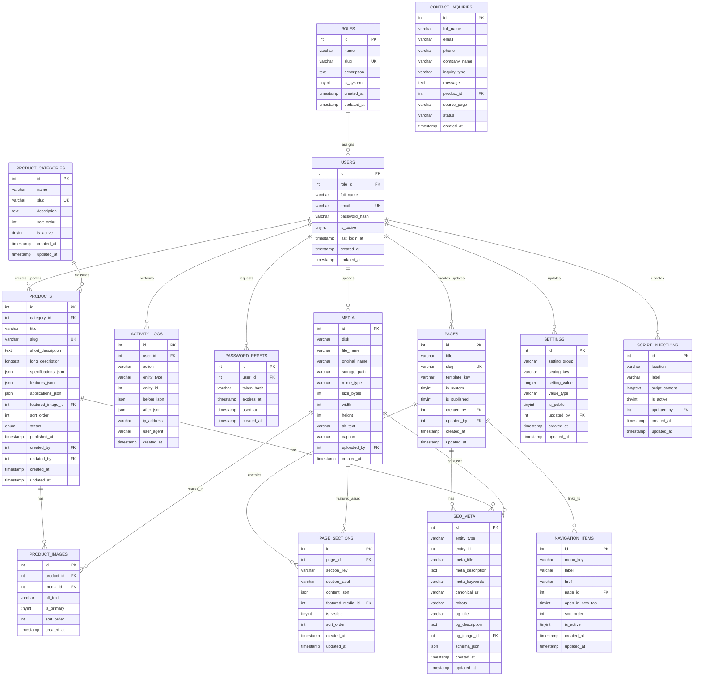

# Nuteck Paper Products CMS - ER Diagram and Data Model

## 1) Modeling Strategy
- Use a normalized core schema for users, pages, products, media, and settings.
- Use `page_sections` as structured content blocks so templates stay locked but content stays editable.
- Use centralized `seo_meta` with `entity_type + entity_id` for page/product/global SEO.
- Use media mapping tables for reusable assets.
- Keep design/theme values in settings (grouped keys), not in templates.

## 2) Entity Overview
- `roles`: role master (Admin, Content Editor).
- `users`: admin users with role mapping.
- `pages`: managed public pages.
- `page_sections`: editable per-page content blocks.
- `product_categories`: catalog categories.
- `products`: product records with publish state and slug.
- `product_images`: product gallery + ordering.
- `media`: uploaded files and metadata.
- `seo_meta`: SEO records for global/page/product.
- `settings`: site, contact, and theme variables.
- `script_injections`: head/footer/admin-managed scripts.
- `navigation_items`: optional dynamic nav links.
- `contact_inquiries`: submitted public form entries.
- `activity_logs`: lightweight audit trail.
- `password_resets`: reset token storage.

## 3) Mermaid ER Diagram

## 4) Key Constraints and Indexes
- Unique:
  - `roles.slug`
  - `users.email`
  - `pages.slug`
  - `product_categories.slug`
  - `products.slug`
  - `settings (setting_group, setting_key)`
  - `seo_meta (entity_type, entity_id)` for one SEO row per entity.
- Foreign keys:
  - all `*_id` references constrained where practical.
- Check constraints (or app-layer validation if DB lacks support):
  - `products.status` in (`draft`, `published`, `archived`).
  - `script_injections.location` in (`head_start`, `head_end`, `body_end`).
  - `seo_meta.entity_type` in (`global`, `page`, `product`).
- Indexes:
  - `products (status, category_id, sort_order)`
  - `products (slug)`
  - `pages (slug, is_published)`
  - `page_sections (page_id, section_key)`
  - `media (created_at)`
  - `activity_logs (user_id, created_at)`

## 5) Role and Permission Relationship
- `users.role_id -> roles.id` defines default capability level.
- Permission enforcement is policy-based in code:
  - Admin routes gated to `roles.slug = admin`
  - Editor-safe routes allow `admin|content_editor`

## 6) Content and SEO Storage Notes
- `page_sections.content_json` stores structured fields per section (headings, text, CTA labels/links, toggles).
- `seo_meta` supports:
  - global defaults (`entity_type=global`, `entity_id=0`)
  - page-level overrides (`entity_type=page`, `entity_id=pages.id`)
  - product-level overrides (`entity_type=product`, `entity_id=products.id`)
- Render layer resolves SEO by priority:
  1. Entity SEO
  2. Global SEO defaults
  3. Template hard fallback

## 7) Media and Theme Mapping
- All image references use `media.id` to avoid duplicated uploads.
- Theme values use `settings` rows, e.g.:
  - `theme.primary_color`
  - `theme.secondary_color`
  - `branding.logo_media_id`
  - `branding.favicon_media_id`
  - `site.title`
  - `site.contact_email`

